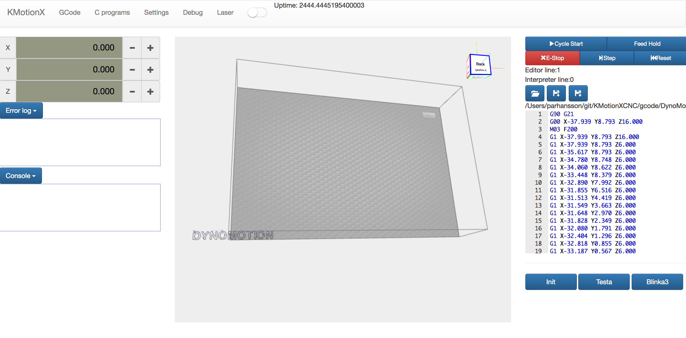

# KMotionXCNC
CNC application for KMotionX




Dependencies
KMotionX
NodeJS


## Install KMotionXCNC

###### 1. Build KMotionXCNC server

Clone repository
```
git clone https://github.com/parhansson/KMotionXCNC.git
```

```
cd KMotionXCNC
```
Configure build for your platform
```
./configure
```
Build project
```
make
```
Install project (some platforms require 'sudo make install') 
```
make install
```

Start server
```
kmxWeb -document_root ./
```

###### 2. Build KMotionXCNC Angular app

This instruction is for development only.
Instructions will be updated for production builds later
```
cd ng2
npm install
npm run serve
```

Open browser and enter 
http://localhost:8081/kmx